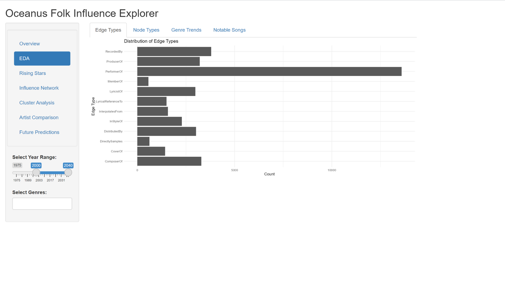
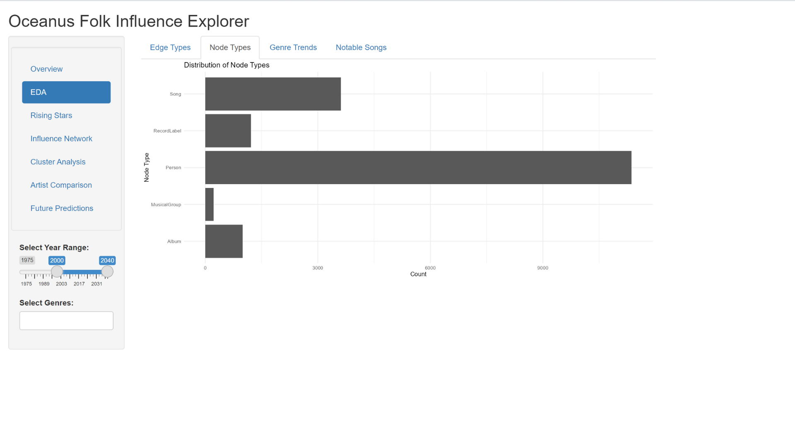
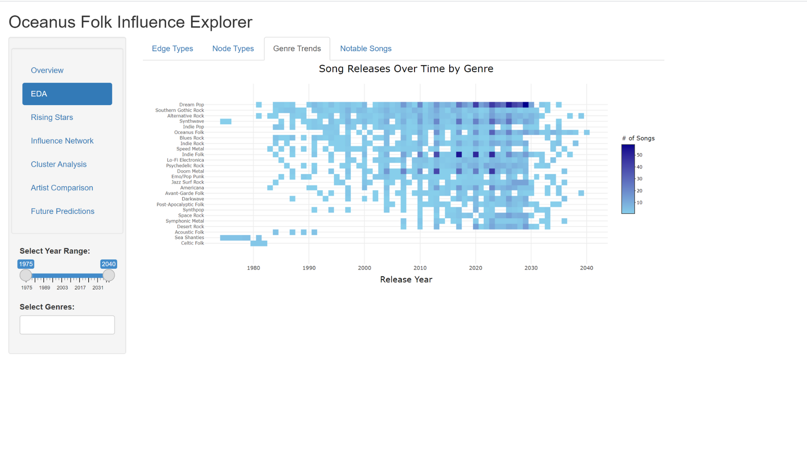
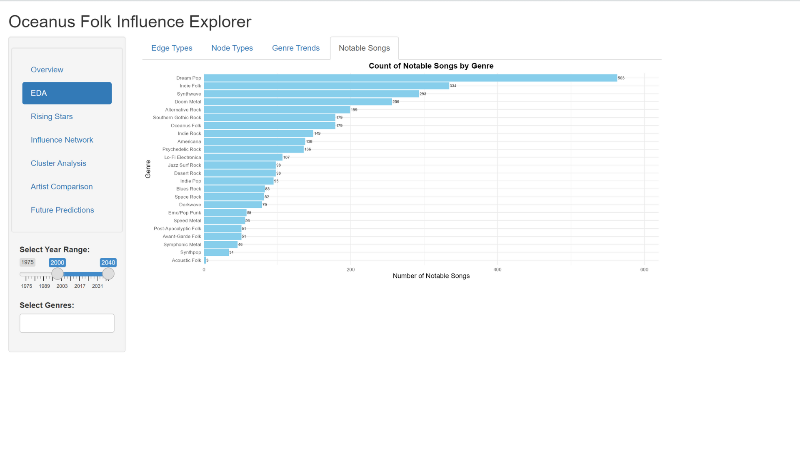
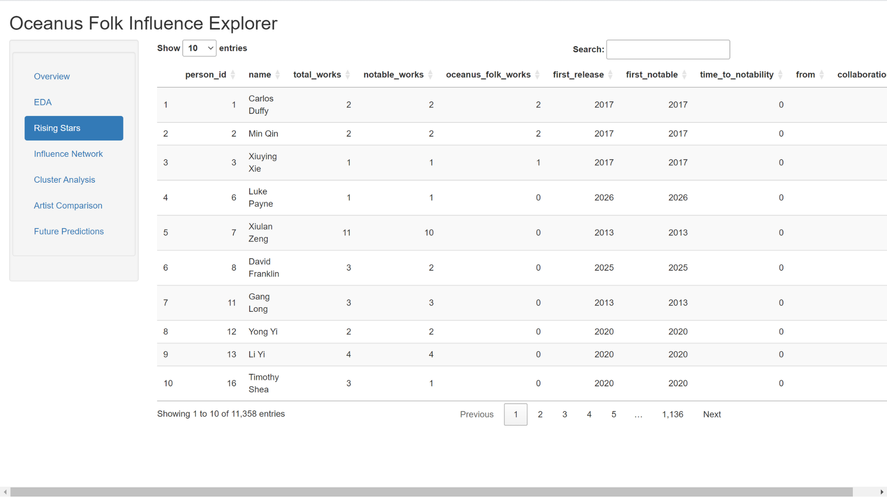
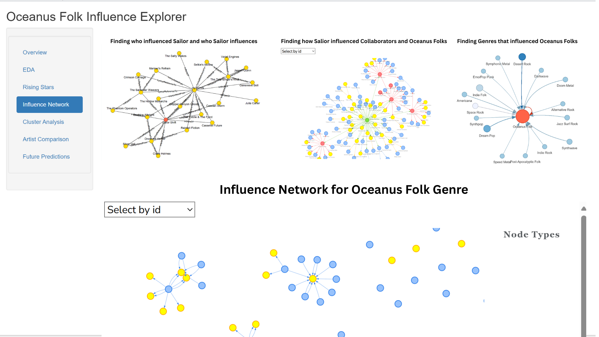
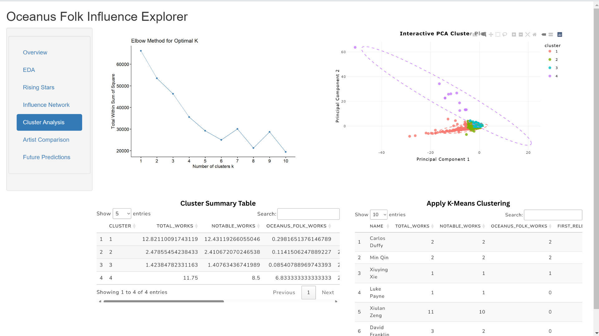
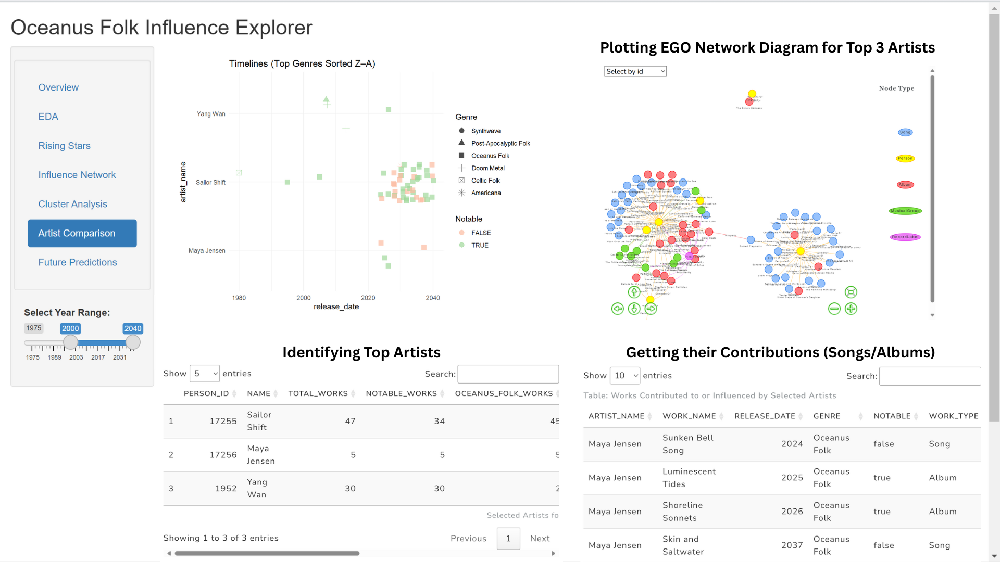
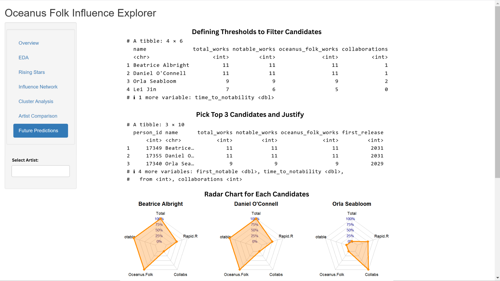

# Introduction

In the current era of digital music, complex networks of artist collaborations, cultural trends, and evolving musical influences frequently contribute to the emergence and evolution of genres. An extensive analytical tool designed for understanding these interactions is the Oceanus Folk Influence Explorer dashboard. It makes use of a structured musical knowledge network to investigate the development and relationships across genres, with an emphasis on Oceanus Folk and the artists and styles that are associated with it.

This interactive application offers an intuitive way to visually and analytically explore artist relationships, track the release history of songs by genre, identify clusters of artists with similar behaviors, and even predict future stars in the Oceanus Folk domain. Through exploratory data analysis, network visualizations, clustering models, and interactive widgets, the dashboard allows users to derive insights that are typically buried in complex musical datasets.

# Motivation

Oceanus Folk is a genre that has quietly but powerfully evolved into a rich, multi-faceted sound that blends traditional elements with modern influences. Artists like Sailor Shift have contributed to its growth by weaving in collaborative energies from a diverse array of genres. However, such transformations are difficult to observe without a structured and visual analytical tool. This dashboard was developed to fill that gap by mapping influence patterns, highlighting temporal trends, and profiling rising contributors within the genre.

This dashboard was created in consequence of the need for a data-driven understanding of genre evolution, particularly in niche and hybrid musical spaces. By examining who collaborates, what genres are converging, and which significant transformations take place, this tool seeks to assist researchers, music analysts, and cultural observers in not only tracking historical development but also predicting future movements. It offers the tools to spot talent as well as the influence pathways that extend several decades.

# Methodology

The Oceanus Folk Influence Explorer is built using a structured JSON-based musical knowledge graph, where nodes represent artists, albums, labels, and songs, and edges represent their relationships. The methodology comprises:

-   Data ingestion and cleaning using `jsonlite`, `janitor`, and `tidyverse` to ensure consistency and usability

-   Network extraction and transformation using `tidygraph`, `igraph`, and `ggraph`

-   Exploratory data visualizations including bar charts, heatmaps, and radar charts

-   Interactive network diagrams using `visNetwork` and dynamic filtering via shiny

-   Clustering analysis with `FactoMineR`, `factoextra`, and PCA-based K-means modeling

-   Predictive profiling using artist metadata such as total works, notable works, and collaboration counts

# Storyboard

## Overview

The Oceanus Folk Influence Explorer dashboard is divided into seven core modules: Overview, EDA, Rising Stars, Influence Network, Cluster Analysis, Artist Comparison, and Future Predictions. Each module is accessible from the left-side navigation and provides an interactive and modular environment for exploring different aspects of the musical landscape.

The dashboard allows users to filter data by release year and genre using sliders and dropdown selectors embedded in each panel. These controls dynamically update the plots and tables, offering a tailored view depending on the user’s interests. Whether the user is interested in the evolution of Dream Pop, identifying high-potential newcomers, or understanding the collaboration network of a particular artist, the dashboard provides contextual information to support deeper exploration.

By switching between modules, users can conduct genre trend analysis, evaluate artist influence networks, and apply clustering techniques to group similar artist behaviors. Parameters such as year range, genre selection, artist ID, and number of clusters are adjustable, giving users complete control over their analysis path.

### 1. Edge and Node Type Distribution (Tabs: Edge Types & Node Types)

In the Edge Types tab, users can analyze the distribution of relationships within the music knowledge graph. The bar chart quantifies how often each edge type appears, such as `PerformerOf`, `ComposerOf`, and `ProducerOf`. This helps users understand which collaborative or influential roles are most common in the network, with `PerformerOf` emerging as the dominant edge type.



In the Node Types tab, users can evaluate the composition of the graph in terms of entities. The chart shows that Person nodes are the most numerous, followed by Songs and Albums. This overview enables users to grasp the dataset’s structural balance between creators, products, and organizations.



***Interactive parameters:***

-   **Select Year Range:** Filters the node and edge types to specific timeframes

-   **Select Genres:** Narrows down the analysis by genre relevance

By adjusting these controls, users can observe how the graph’s structure changes over decades and isolate patterns such as the growing role of record labels or the emergence of new node types.

### 2. Song Releases Over Time by Genre (Tab: Genre Trends)

This **heatmap** enables users to explore how different genres have evolved over time by tracking the number of song releases per year. Each cell represents a count of songs for a specific genre and year, with darker shades indicating higher volume. Genres such as Oceanus Folk, Dream Pop, and Indie Rock show noticeable intensity in recent decades.

This chart helps users identify when genres like Oceanus Folk began to rise, plateau, or decline. It also facilitates cross-genre temporal comparisons.

***Interactive parameters:***

-   **Select Year Range:** Zooms into specific historical periods

-   **Select Genres:** Highlights genre-specific release patterns

Users can use this module to detect creative bursts, align genre popularity with cultural trends, or compare generational genre shifts.



### 3. Count of Notable Songs by Genre (Tab: Notable Songs)

This bar chart summarizes the number of notable songs per genre, providing a snapshot of genre prominence in terms of cultural or critical recognition. Genres like Dream Pop, Indie Folk, and Synthwave dominate, while Oceanus Folk also holds a strong position.

Users can use this visualization to identify which genres are most critically significant and how Oceanus Folk compares to adjacent styles in influence and output.

***Interactive parameters:***

-   **Select Year Range:** Filters notable song counts by decade

-   **Select Genres:** Refines focus to specific genres of interest

This module supports strategic evaluation of genre importance and benchmarking for cultural impact studies.



### 4. Rising Stars Table (Tab: Rising Stars)

This sortable data table presents up-and-coming artists based on metrics such as total works, notable works, and Oceanus Folk contributions. Additional fields like first release year, first notable release, and time to notability provide context on artist progression.

Users can search, sort, and scan for early-career artists showing signs of rapid recognition or high alignment with Oceanus Folk.

***Interactive parameters:***

-   **Search Bar:** Enables artist-level filtering

-   **Column Sorting:** Allows comparison of artist trajectories

This section is ideal for scouting talent, evaluating artistic momentum, and forming hypotheses on future influence.



### 5. Influence Network for Oceanus Folk (Tab: Influence Network)

This section displays three influence networks.

-   The first graph visualizes who influenced Sailor Shift and whom she influenced

-   The second graph maps how Sailor’s collaborators and Oceanus Folk artists are connected

-   The third graph shows which genres have influenced Oceanus Folk

Users can explore the diffusion of influence within and across artists and genres. These networks support visual storytelling of collaboration, stylistic exchange, and legacy.

***Interactive parameters:***

-   **Select by ID Dropdown:** Focuses the network on a specific artist

These visualizations allow users to identify artistic hubs, indirect influence pathways, and genre interconnections shaping Oceanus Folk.



### 6. Cluster Analysis Module (Tab: Cluster Analysis)

This module combines clustering methods with PCA for artist segmentation.

-   The Elbow Method chart helps users determine the optimal number of clusters

-   The PCA Cluster Plot shows artist groupings in reduced dimensions

-   Summary tables provide statistics for each cluster and list members

Users can uncover structural similarities in artist behaviors such as volume of works, Oceanus Folk alignment, or notability.

***Interactive parameters:***

-   **Cluster Count (K):** User can interpret optimal cluster count from the Elbow plot

-   **Search and Filter:** Navigate and examine specific clusters or artists

This module is suited for market segmentation, pattern discovery, and comparing artist archetypes.



### 7. Artist Comparison Dashboard (Tab: Artist Comparison)

This section supports side-by-side analysis of top artists such as Sailor Shift, Maya Jensen, and Yang Wan.

-   The timeline plot shows when each artist released works across genres

-   The EGO network graph maps each artist’s direct and indirect influences

-   A searchable table lists their individual works, with genre and notability tags

Users can track artistic evolution, compare genre engagements, and analyze collaboration density.

***Interactive parameters:***

-   **Select Year Range:** Filters works shown in the timeline

-   **Select Artist by ID:** Updates network and table view

-   **Search Bar:** Focuses on specific work names or genres

This panel supports deep artist profiling and network contextualization of musical influence.



### 8. Future Predictions (Tab: Future Predictions)

This module forecasts future stars in Oceanus Folk using a combination of thresholds and radar charts.

-   The tables highlight candidates with high scores across total works, notable works, and Oceanus Folk contributions

-   Radar charts visually compare key metrics including collaboration count and time to notability

Users can use this module to validate predictions, prioritize emerging talent, and justify decisions using concrete data.

***Interactive parameters:***

-   **Select Artist Dropdown:** Enables detailed focus on specific candidates

-   **Threshold Tables:** Filters for artists exceeding custom-defined benchmarks

This module is essential for forward-looking trend analysis, talent evaluation, and strategic discovery.



# Skeleton Code for Shiny App

The skeleton code for the Oceanus Folk Influence Explorer Shiny App establishes a modular framework that integrates data preprocessing, interactive visualization, and exploratory analysis. The preprocessing section loads and cleans a JSON-based music knowledge graph, maps entity relationships, and constructs an artist profile table with features like total works, genre contributions, and collaboration counts. This structured data forms the foundation for rising star detection, clustering, and influence mapping modules.

On the user interface side, the app organizes content into themed navigation panels such as EDA, Influence Network, Rising Stars, and Future Predictions. Each panel renders context-specific visualizations using `ggplot2`, `plotly`, and `visNetwork`, and offers filters like year range sliders and genre selectors for user-driven exploration. The server logic links user input to reactive outputs, making the dashboard dynamic, scalable, and suitable for analyzing trends within the Oceanus Folk music ecosystem.

```{r}
# --- Load Required Libraries ---
library(shiny)
library(tidyverse)
library(jsonlite)
library(janitor)
library(lubridate)
library(tidygraph)
library(igraph)
library(ggraph)
library(DT)
library(plotly)
library(visNetwork)
library(factoextra)
library(FactoMineR)
library(fmsb)
library(forcats)

# --- Data Preprocessing ---
# Load and clean nodes and edges from JSON
kg <- fromJSON("data/MC1_graph.json")
nodes_tbl <- as_tibble(kg$nodes) %>% clean_names()
edges_tbl <- as_tibble(kg$links) %>% clean_names()

# Create ID mapping for node and edge references
nodes_tbl <- nodes_tbl %>% mutate(release_date = as.integer(release_date))
id_map <- tibble(id = nodes_tbl$id, index = seq_len(nrow(nodes_tbl)))

edges_tbl_mapped <- edges_tbl %>%
  left_join(id_map, by = c("source" = "id")) %>% rename(from = index) %>%
  left_join(id_map, by = c("target" = "id")) %>% rename(to = index) %>%
  filter(!is.na(from), !is.na(to))

nodes_tbl_clean <- nodes_tbl %>% mutate(id = as.integer(id)) %>% distinct()

# Build graph object
graph <- tbl_graph(nodes = nodes_tbl_clean, edges = edges_tbl_mapped, directed = TRUE)

# --- Derive Artist and Work Tables ---
people <- nodes_tbl_clean %>% filter(node_type == "Person") %>% select(person_id = id, name)
songs_albums <- nodes_tbl_clean %>%
  filter(node_type %in% c("Song", "Album")) %>%
  select(work_id = id, any_of(c("release_date", "genre", "notable")))

# Contribution and collaboration extraction
contribution_types <- c("ComposerOf", "PerformerOf", "ProducerOf", "LyricistOf", "RecordedBy")
collab_types <- c("LyricalReferenceTo", "CoverOf", "InterpolatesFrom", "DirectlySamples")

created_links <- edges_tbl_mapped %>%
  filter(edge_type %in% contribution_types)

# Artist work profile
artist_works <- created_links %>%
  left_join(id_map, by = c("from" = "index")) %>% rename(person_id = id) %>%
  left_join(id_map, by = c("to" = "index")) %>% rename(work_id = id) %>%
  left_join(songs_albums, by = "work_id")

rising_star_profile <- artist_works %>%
  group_by(person_id) %>%
  summarise(
    total_works = n(),
    notable_works = sum(notable, na.rm = TRUE),
    oceanus_folk_works = sum(genre == "Oceanus Folk", na.rm = TRUE),
    first_release = min(release_date, na.rm = TRUE),
    first_notable = min(release_date[notable == TRUE], na.rm = TRUE),
    .groups = "drop"
  ) %>%
  mutate(
    time_to_notability = ifelse(!is.na(first_notable), first_notable - first_release, NA)
  )

# Add collaboration counts
collaborations <- edges_tbl_mapped %>%
  filter(edge_type %in% collab_types) %>%
  count(from, name = "collaborations") %>%
  left_join(id_map, by = c("from" = "index")) %>%
  rename(person_id = id)

rising_star_profile <- rising_star_profile %>%
  left_join(collaborations, by = "person_id") %>%
  mutate(collaborations = replace_na(collaborations, 0)) %>%
  inner_join(people, by = "person_id")

# --- UI ---
ui <- fluidPage(
  titlePanel("Oceanus Folk Influence Explorer"),
  
  sidebarLayout(
    sidebarPanel(
      width = 2,
      navlistPanel(
        id = "main_tabs",
        widths = c(12, 12),
        tabPanel("Overview"),
        tabPanel("EDA"),
        tabPanel("Rising Stars"),
        tabPanel("Influence Network"),
        tabPanel("Cluster Analysis"),
        tabPanel("Artist Comparison"),
        tabPanel("Future Predictions")
      ),
      conditionalPanel(
        condition = "input.main_tabs == 'EDA'",
        sliderInput("year_range", "Select Year Range:",
                    min = min(nodes_tbl$release_date, na.rm = TRUE),
                    max = max(nodes_tbl$release_date, na.rm = TRUE),
                    value = c(2000, 2040)),
        selectInput("genre_select", "Select Genres:",
                    choices = sort(unique(na.omit(nodes_tbl$genre))),
                    selected = NULL, multiple = TRUE)
      )
    ),
    mainPanel(uiOutput("subtabs_ui"))
  )
)

# --- Server ---
server <- function(input, output, session) {
  
  output$subtabs_ui <- renderUI({
    switch(input$main_tabs,
           "Overview" = h3("Explore Sailor Shift's career, Oceanus Folk genre evolution, and rising music stars."),
           "EDA" = tabsetPanel(
             tabPanel("Edge Types", plotOutput("edgeTypePlot")),
             tabPanel("Node Types", plotOutput("nodeTypePlot")),
             tabPanel("Genre Trends", plotlyOutput("genreHeatmap")),
             tabPanel("Notable Songs", plotOutput("notableSongsPlot"))
           ),
           "Rising Stars" = DT::dataTableOutput("risingStarTable"),
           "Influence Network" = visNetworkOutput("influenceNetwork", height = "700px"),
           "Cluster Analysis" = tagList(
             plotOutput("elbowPlot"),
             plotlyOutput("pcaPlot"),
             DT::dataTableOutput("clusterSummary")
           ),
           "Artist Comparison" = tagList(
             DT::dataTableOutput("artistComparisonTable"),
             plotOutput("timelinePlot"),
             visNetworkOutput("egoNetwork", height = "600px")
           ),
           "Future Predictions" = tagList(
             DT::dataTableOutput("futureStarsTable"),
             plotOutput("radar1"),
             plotOutput("radar2"),
             plotOutput("radar3")
           )
    )
  })
  
  # Sample plot render functions
  output$edgeTypePlot <- renderPlot({
    ggplot(edges_tbl_mapped, aes(y = edge_type)) +
      geom_bar() +
      labs(title = "Distribution of Edge Types", y = "Edge Type", x = "Count") +
      theme_minimal()
  })
  
  output$nodeTypePlot <- renderPlot({
    ggplot(nodes_tbl_clean, aes(y = node_type)) +
      geom_bar() +
      labs(title = "Distribution of Node Types", y = "Node Type", x = "Count") +
      theme_minimal()
  })
  
  output$genreHeatmap <- renderPlotly({ ... })  # Skipped for brevity
  output$notableSongsPlot <- renderPlot({ ... })  # Skipped for brevity
  output$risingStarTable <- DT::renderDataTable({ rising_star_profile })
}

# --- Launch App ---
shinyApp(ui = ui, server = server)
```

# Conclusion

The Oceanus Folk Influence Explorer represents a comprehensive effort to make sense of the complex and dynamic relationships within the Oceanus Folk genre and its surrounding musical ecosystem. By leveraging a structured graph dataset, the app allows users to visualize and analyze not only artistic collaborations but also broader genre influences and rising stars with a high degree of interactivity. Each module within the app is built with a clear analytical purpose, enabling both macro-level and micro-level exploration of how the genre has evolved over time and who has been instrumental in its transformation.

The dashboard’s integration of exploratory data analysis, network graphs, clustering algorithms, and prediction techniques showcases the potential of combining data science with music analytics. Through features such as temporal filters, genre selectors, and artist-specific networks, the dashboard provides a platform for researchers and enthusiasts to uncover hidden connections, identify genre-defining moments, and validate emerging talents using quantitative metrics. These tools support more informed storytelling and cultural research in the music domain.

Ultimately, the Oceanus Folk Influence Explorer demonstrates how interactive data applications can empower users to investigate niche genres with depth and clarity. It bridges the gap between raw musical data and actionable insights by translating complex relationships into accessible and meaningful visual narratives. As music continues to evolve through digital platforms, tools like this dashboard will become increasingly vital in preserving cultural memory, guiding industry decisions, and spotlighting the artists of tomorrow.
